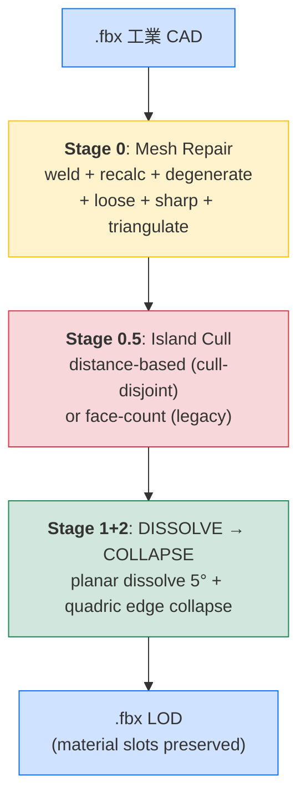
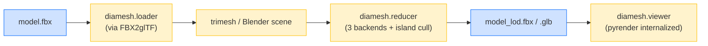
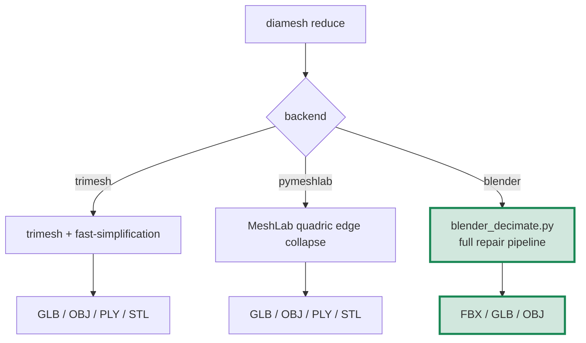

# DIAMesh 操作手冊

> Delta Intelligence Agent for **Mesh** processing — Python 3D FBX viewer + 自動 mesh reduction toolkit，建在 [pyrender](https://github.com/mmatl/pyrender) 之上。

本手冊涵蓋：

* **問題背景** — DIAMesh 解什麼問題、為什麼需要它
* **架構** — pyrender 內嵌 + 三組 reducer backend + 跨平台 vendor binary
* **CLI 指令** — `view` / `info` / `reduce` 完整參考
* **Backend 選擇** — trimesh / pymeshlab / blender 三條路線的 trade-off
* **Mesh Repair Pipeline** — 從 weld 到 island cull 的七階段內部流程
* **Production LOD Presets** — 30 台設備產線 viewer 的兩個推薦配置
* **跨平台部署** — Windows 即用、Linux/macOS 一行 setup
* **故障排除** — 常見錯誤跟修法

如要快速看路線圖請翻 [`ROADMAP.md`](ROADMAP.md)。

---

## 目錄

0. [問題背景與方案概覽](#0-問題背景與方案概覽)
1. [Pipeline 全貌](#1-pipeline-全貌)
2. [環境設定](#2-環境設定)
3. [CLI 指令參考](#3-cli-指令參考)
4. [Backend 選擇指南](#4-backend-選擇指南)
5. [Mesh Repair Pipeline 內部解剖](#5-mesh-repair-pipeline-內部解剖)
6. [Production LOD Presets](#6-production-lod-presets)
7. [跨平台部署](#7-跨平台部署)
8. [故障排除](#8-故障排除)
9. [限制與未來工作](#9-限制與未來工作)

---

## 0. 問題背景與方案概覽

### 0.1 要解決的問題

工業 3D viewer 的核心痛點：**一條產線 30 台設備同畫面渲染就卡**。每台設備是 100k+ face 的 CAD-export FBX，30 台 = 3M+ face → 即時渲染崩潰。

但需求又不能讓細節全砍：**單台設備 zoom-in 看仍要保留可辨識的結構** —— LOD（Level of Detail）系統的經典場景。

DIAMesh 處理的就是這個跨度：
* **FBX 載入 + 預覽**（Phase 1）— 看清楚原始 mesh
* **自動 mesh reduction**（Phase 2）— 砍 face 但保結構連續性
* **LOD-friendly 輸出**（Phase 2.5）— 拋掉真正看不到的微結構，主結構完整

### 0.2 為什麼選 pyrender 為基底

幾個 Python 3D viewer 候選：

| 工具 | 評估 |
|---|---|
| `pyrender` | ✅ 純 Python、MIT、PBR rendering、scene graph 可擴展、active project |
| `vedo` | VTK-based，重，互動體驗一般 |
| `open3d` | 強大但偏 point cloud / vision 應用，FBX 支援不直接 |
| `trimesh.Scene().show()` | 太簡單，作 viewer 不夠正式 |
| `panda3d` | 遊戲引擎重型 |

DIAMesh 選 **C 路（內嵌複製 pyrender 源碼）** —— 把 pyrender 當 DIAMesh 自家代碼，未來客製化（heatmap shader、整合 GUI）可直接改 internals。

### 0.3 三段式 mesh reduction 流程



---

## 1. Pipeline 全貌



### 1.1 倉儲結構

```
DIAMesh/
├── pyrender/           # ⭐ 內嵌的 mmatl/pyrender 源碼（MIT 授權保留）
├── diamesh/            # ⭐ DIAMesh 自家層
│   ├── loader.py       # FBX → trimesh 透過 vendored FBX2glTF
│   ├── viewer.py       # 包 pyrender.Viewer
│   ├── reducer.py      # mesh reduction 三 backend dispatcher
│   └── cli.py          # `diamesh view|info|reduce`
├── scripts/
│   ├── blender_decimate.py    # Blender headless 全套 pipeline
│   └── setup_vendor.py        # Linux/macOS 一鍵下載 binary
├── vendor/
│   ├── fbx2gltf/              # FBX2glTF v0.9.7 (MIT)
│   ├── assimp/                # Assimp v6.0.5 (BSD-3)
│   ├── blender/               # Blender Portable (gitignored, manual)
│   ├── PYRENDER_LICENSE.md
│   ├── FBX2GLTF_LICENSE.md
│   ├── ASSIMP_LICENSE.md
│   └── BLENDER_SETUP.md
└── tests/fixtures/
    └── sphere.fbx            # 自動生成的 unit-test fixture
```

### 1.2 兩條 reducer 主路線



**Blender backend 是 production 推薦** —— 唯一保留材質/材質貼圖/層級結構、唯一支援 island cull 跟全套 mesh repair。trimesh / pymeshlab 是輕量替代給快速實驗用。

---

## 2. 環境設定

### 2.1 安裝

> **內網用戶取得專案的方式**：DIAMesh 不對外公開，內網其他用戶**請向開發團隊（James 老大 / 小福）索取 DIAMesh 最新 zip 檔**。將 zip 解壓到本機任一目錄即可。

```bash
cd <unpacked-DIAMesh-directory>
pip install -e .
```

### 2.2 平台特定 vendor binary

**Windows 用戶**：FBX2glTF.exe 跟 Assimp DLL 已經 git-tracked，clone 即用。

**Linux / macOS 用戶**：跑一次 setup script 自動下載對應 binary：

```bash
python scripts/setup_vendor.py
```

該腳本會：
1. 偵測 `platform.system()` 跟 `platform.machine()`
2. 下載 `FBX2glTF v0.9.7` 對應 release 到 `vendor/fbx2gltf/`
3. 下載 `Assimp v6.0.5` 對應 release 並解出 shared library 到 `vendor/assimp/`
4. 自動 `chmod 0o755`（POSIX 系統的執行權限）
5. 已存在則跳過（idempotent）

### 2.3 Blender 安裝（用 backend=blender 才需要）

Blender Portable 太大（約 250 MB）+ GPL 授權考量，DIAMesh **不自動下載** Blender。手動部署：

1. https://www.blender.org/download/ 下載 portable / zip / tar.xz / dmg（建議 LTS 4.2.x）
2. 解壓 / 拷貝到 `vendor/blender/` 即可（DIAMesh 自動偵測 `vendor/blender/blender.exe` 或 `vendor/blender/blender`）
3. 或設環境變數 `BLENDER_EXE=/path/to/blender`

詳細指引見 [`vendor/BLENDER_SETUP.md`](../vendor/BLENDER_SETUP.md)。

### 2.4 驗證安裝

```bash
diamesh --help              # CLI 主入口
diamesh info tests/fixtures/sphere.fbx
# file: tests/fixtures/sphere.fbx
#   n_meshes: 1
#   total_vertices: 642
#   total_faces: 1280
#   ...
```

---

## 3. CLI 指令參考

### 3.1 `diamesh view <file>`

開啟互動式 3D viewer 顯示 mesh。

```bash
diamesh view data/Robot.fbx
```

**鍵盤操作**：
| key | 行為 |
|---|---|
| 左鍵拖 | 旋轉 |
| 中鍵拖 / Shift+左鍵拖 | 平移 |
| 滾輪 / 右鍵拖 | 縮放 |
| `P` | 存截圖（**注意**：原 pyrender 用 S，DIAMesh 改 P 避免跟 Win+Shift+S 衝突）|
| `R` | 開始/停止 GIF 錄影 |
| `W` | 切 wireframe 模式 |
| `H` | 切 shadows |
| `F` | 切 fullscreen |
| `Z` | reset 視角 |
| `Q` | 離開 |

### 3.2 `diamesh info <file>`

不開窗，印 mesh 統計資料。

```bash
diamesh info data/Robot.fbx
```

輸出：mesh 數、頂點總數、面數總數、watertight 計數、各 mesh 邊界框。

### 3.3 `diamesh reduce <file>`

自動 mesh reduction。

**基本用法**：
```bash
diamesh reduce data/Robot.fbx --target-faces 5000
diamesh reduce data/Robot.fbx --ratio 0.25 -o data/Robot_lod.glb
```

**完整參數**：
| flag | type | 說明 |
|---|---|---|
| `--target-faces N` | int | 目標 face 數量（與 `--ratio` 二選一） |
| `--ratio R` | float | 保留 face 比例 0..1（與 `--target-faces` 二選一） |
| `--output / -o PATH` | str | 輸出檔（預設 `<input>_reduced.glb`）；副檔名決定格式 |
| `--backend {trimesh,pymeshlab,blender}` | str | reducer backend（預設 trimesh）|
| `--cull-disjoint THRESHOLD` | float | (blender) 距離主結構 > 此比例的 island 刪除（預設 0 = disabled）|
| `--cull-anchor-count N` | int | (blender) 取最大 N 個 island 為 anchor（預設 10）|
| `--min-island-faces N` | int | (blender, 粗暴) 砍 face < N 的島（預設 0）|

**輸出格式**：
* `.fbx` — 完整保留 material（要 `--backend blender`）
* `.glb` — 預設，PBR material 完整保留
* `.obj` / `.ply` / `.stl` — 純幾何，丟材質

---

## 4. Backend 選擇指南

### 4.1 三 backend 比較

| 維度 | trimesh | pymeshlab | **blender** ⭐ |
|---|:---:|:---:|:---:|
| 速度 | ⚡ 快 | 慢 | 慢 |
| 安裝 | 內建 | `pip install pymeshlab` | 手動下 Blender Portable |
| Material 保留 | ❌ 全丟 | ❌ 全丟 | ✅ 完整 |
| Texture 保留 | ❌ | ❌ | ✅ embed |
| 部件層級保留 | ❌ | ❌ | ✅ → 1 mesh + multi-material |
| Boundary 保護 | ❌ | ✅ | ✅ |
| Sharp edge 保護 | ❌ | ❌ | ✅ |
| Mesh repair | ❌ | ❌ | ✅ 完整 7 階段 |
| Island cull | ❌ | ❌ | ✅ |
| FBX output | ✅ via assimp | ❌ | ✅ |
| **適用場景** | smoke test、快速實驗 | 高品質但無 material 需求 | **生產 LOD** |

### 4.2 推薦選擇

* **要 material / production LOD** → `--backend blender`
* **快速 smoke test 不在乎材質** → `--backend trimesh`（預設）
* **要 boundary 保護但不要 Blender** → `--backend pymeshlab`

---

## 5. Mesh Repair Pipeline 內部解剖

只在 `--backend blender` 啟用，由 `scripts/blender_decimate.py` 在 Blender headless 內執行。

### 5.1 全流程

```mermaid
flowchart TD
    Import[1. import_scene.fbx<br/>讀入 24 mesh objects + materials]:::stage
    Join[2. JOIN ALL<br/>合成 single mesh + multi-material slots]:::join
    
    subgraph S0[Stage 0: Mesh Repair]
        A[A. recalc_face_normals<br/>修正法向量翻轉]
        Weld[0. remove_doubles<br/>跨 part weld 0.1mm]
        B[B. dissolve_degenerate<br/>清零面積 sliver]
        C[C. delete loose<br/>刪孤立 vertex/edge]
        E[E. triangulate<br/>統一拓撲]
        D[D. mark sharp<br/>30° 以上邊界打 sharp 標記]
    end
    
    Cull[Stage 0.5: cull_disjoint_islands<br/>距離主結構 > threshold 的島刪除]:::cull
    
    subgraph Decimate[Stage 1+2: Decimation]
        Diss[1. DISSOLVE 5°<br/>共面合併 (lossless)]
        Coll[2. COLLAPSE target ratio<br/>delimit MATERIAL/SHARP/SEAM]
    end
    
    Export[Export FBX<br/>embed_textures + COPY path mode]:::stage
    
    Import --> Join
    Join --> A
    A --> Weld
    Weld --> B
    B --> C
    C --> E
    E --> D
    D --> Cull
    Cull --> Diss
    Diss --> Coll
    Coll --> Export
    
    classDef stage fill:#cfe2ff,stroke:#0d6efd;
    classDef join fill:#f8d7da,stroke:#dc3545,stroke-width:2px;
    classDef cull fill:#fff3cd,stroke:#ffc107;
```

### 5.2 為什麼 JOIN ALL 是關鍵

工業 CAD-export FBX 常見「同位置、不同 mesh object、不同 vertex index」的接觸面 vertex —— 視覺上貼合，topology 上是兩條獨立 edge。reduce 時兩個 vertex 各自 collapse 不同方向 → 接觸面分離 → 漂浮碎片。

`bpy.ops.object.join()` 把所有 mesh objects 合併成單一 mesh，per-face material_index 自動保留，**配合 Stage 0 的全局 weld 一次解決 cross-part 對齊**。

### 5.3 Stage 0 各步驟的功能

| 步驟 | bmesh op | 解決什麼 |
|---|---|---|
| A. Recalc normals | `recalc_face_normals` | CAD-export 法向量翻轉 → 讓 NORMAL delimit 正確 |
| 0. Weld | `remove_doubles(dist=0.1mm)` | CAD-patch seam 跟 cross-part 接觸面對齊 |
| B. Dissolve degenerate | `dissolve_degenerate(dist=1e-5)` | 零面積 sliver 三角形 |
| C. Loose cull | `delete(geom=loose)` | 孤立 vertex/edge → 直接消除「漂浮碎片」一部分來源 |
| D. Mark sharp | `edge.smooth = False` | 30° 以上邊界 mark sharp → SHARP delimit 才生效 |
| E. Triangulate | `triangulate(BEAUTY/BEAUTY)` | 混合 quad/ngon → 純 tri，COLLAPSE 行為一致 |

### 5.4 Stage 0.5 — Distance-based Island Cull

CAD assemblies 常含「結構上 disjoint 但視覺上貼合」的 sub-component（螺絲蓋、感測器探頭等）。原 mesh 因為 dense triangulation 視覺包圍它們所以看起來貼合，reduce 後砍掉周圍 → ground truth 露出 → **漂浮碎片**。

`--cull-disjoint THRESHOLD` 演算法：
1. BFS 找 connected face islands
2. 取最大 N 個 island（預設 N=10）為 anchor
3. 對其他 island 計算 bbox 到任一 anchor 的最近距離
4. 距離 / 整體 mesh 對角線 > threshold → 真漂浮 → 刪
5. 接觸 anchor 的 → 保留（即使 face 少）

**關鍵點**：主框架的金屬桿往往也是 disjoint island（每根 50-200 face），但 bbox **接觸面板** → 被保留。螺絲蓋 bbox 離主結構幾 mm → 刪。

threshold 調參指南：
* `0.01` — 只刪離得很遠的（保留接觸或極近的零件）
* **`0.02`** — 推薦起點（細節保留 vs 漂浮清除的平衡）
* `0.03` — 中等
* `0.05+` — 寬鬆

### 5.5 Stage 1+2 — Two-pass Decimation

**Stage 1 DISSOLVE** (planar/limited dissolve):
* `angle_limit = 5°`：5° 以內的相鄰面合併為 n-gon
* `delimit = {NORMAL}`：不跨法向量斷層合併
* **視覺無損**：純消除冗餘三角化，silhouette 不動

**Stage 2 COLLAPSE** (quadric edge collapse):
* `ratio = target_faces / post-dissolve faces`
* `delimit = {MATERIAL, SHARP, SEAM}`：不跨材質邊、銳邊、UV seam
* `use_collapse_triangulate = True`：結果保 tri

兩階段串聯：DISSOLVE 先消化平面冗餘（lossless），COLLAPSE 才動 silhouette geometry → 對工業 CAD 板狀結構特別有效。

---

## 6. Production LOD Presets

針對「30 台設備一條產線同畫面 viewer」的兩個推薦配置。

### 6.1 Preset A — 「最低 face / 30 台同跑」

```bash
diamesh reduce data/Machine.fbx \
    --ratio 0.1 \
    --backend blender \
    --cull-disjoint 0.02 \
    -o data/Machine_lodA.fbx
```

**特性**：
* face 砍到 ~10%（input 75k → output ~7k）
* 30 台 × 7k = **~210k face / 整條產線**
* 主框架完整、漂浮接近清乾淨
* GPU draw call 友善（單 mesh + multi-material）

**適用視角**：產線 zoom-out（俯瞰整條產線、看到所有 30 台設備）

### 6.2 Preset B — 「視覺優先 / GPU 預算夠」

```bash
diamesh reduce data/Machine.fbx \
    --ratio 0.25 \
    --backend blender \
    --cull-disjoint 0.03 \
    -o data/Machine_lodB.fbx
```

**特性**：
* face 砍到 ~25%（input 75k → output ~17k）
* 30 台 × 17k = **~510k face / 整條產線**
* 細節保留多，機器手臂等子結構可辨識
* 中等 GPU 仍流暢

**適用視角**：點擊單台設備聚焦時的特寫

### 6.3 兩 Preset 切換策略

production viewer 可以同時生成兩份：
```bash
diamesh reduce machine.fbx --ratio 0.1  --backend blender --cull-disjoint 0.02 -o machine_lodA.fbx
diamesh reduce machine.fbx --ratio 0.25 --backend blender --cull-disjoint 0.03 -o machine_lodB.fbx
```

viewer 根據 camera 距離自動切換 LOD：遠→A，近→B。這就是 LOD 的標準應用方式。

### 6.4 為什麼這兩組是甜蜜點（實測過）

針對 5AxisGlueSpraying.fbx (75k face, 24 part) 跑出的對比：

| 配置 | 主框架 | 漂浮 | 細節 |
|---|:---:|:---:|:---:|
| `r0.1_c0.01` | ✓ | 大量清掉 | 中等（面板有破洞）|
| `r0.1_c0.015` | ✓ | 部分清 | 中等 |
| **`r0.1_c0.02`** ⭐ | ✓ | **僅 1-2 黑物** | 中等 |
| `r0.1_c0.03` | ✓ | 殘留較多 | 中等 |
| **`r0.25_c0.03`** ⭐ | ✓ | 少量殘留 | **多** |
| `r0.5_c0.03` | ✓ | 仍漂浮 | 多（cull 對高 ratio 不夠）|

`r0.1_c0.02` 跟 `r0.25_c0.03` 在「漂浮清除」+「主結構保留」+「細節密度」的三維權衡達到 Pareto 前沿。

---

## 7. 跨平台部署

### 7.1 平台支援矩陣

| 工具 | Windows x64 | Linux x64 | macOS x64 | macOS arm64 |
|---|:---:|:---:|:---:|:---:|
| FBX2glTF | ✓ vendored | auto-download | auto-download | auto-download (via x64) |
| Assimp | ✓ vendored | auto-download | auto-download | auto-download |
| Blender | manual | manual | manual | manual |
| pyrender | ✓ | ✓ | ✓ | ✓ |
| trimesh | ✓ | ✓ | ✓ | ✓ |
| pymeshlab | ✓ (optional) | ✓ (optional) | ✓ (optional) | ✓ (optional) |

### 7.2 Linux/macOS 一鍵 setup

> 內網用戶先向開發團隊取得 DIAMesh zip，解壓到本機。

```bash
cd <unpacked-DIAMesh-directory>
pip install -e .
python scripts/setup_vendor.py    # 自動下載 platform-specific binary（仍需可連 GitHub Release）
# 手動下載 Blender Portable 解壓到 vendor/blender/（看 vendor/BLENDER_SETUP.md）
diamesh reduce my.fbx --ratio 0.1 --cull-disjoint 0.02 --backend blender -o my_lod.fbx
```

### 7.3 為什麼不全部 vendor 進 repo

* **Windows .exe / .dll**：~16 MB 總，commit 進 repo（最常見場景，clone 即用）
* **Linux ELF / macOS dylib**：等量大小但每加一個 platform 都要 commit ~10MB+ → 不 sustainable
* **Blender Portable**：~450 MB 解壓後，**且是 GPL** → bundle 進 MIT repo 有 license 感染風險，subprocess 呼叫安全

setup_vendor.py 是 trade-off：repo 保持輕量、Linux/macOS 用戶一行命令補齊。

---

## 8. 故障排除

### 8.1 `ModuleNotFoundError: No module named 'diamesh'`
忘了 `pip install -e .`。先 `cd` 進 repo 根目錄再 install。

### 8.2 `RuntimeError: FBX2glTF binary not found at vendor/fbx2gltf`
在 Linux/macOS 上沒跑 `python scripts/setup_vendor.py`。

### 8.3 `pyassimp.errors.AssimpError: assimp library not found`
* Windows：DLL 應該在 `vendor/assimp/` 但 reducer.py 沒找到 → 檢查 PATH 或重新 git pull
* Linux/macOS：跑 `python scripts/setup_vendor.py`

### 8.4 `RuntimeError: Blender executable not found`
要用 `--backend blender` 但 Blender 沒部署：
* 設環境變數 `BLENDER_EXE=/path/to/blender`
* 或下載 Blender Portable 解壓到 `vendor/blender/`
* 詳見 `vendor/BLENDER_SETUP.md`

### 8.5 NumPy 2.x — `AttributeError: np.infty`
DIAMesh 已經 patch 過內嵌 pyrender。如果您看到這個 error，可能 pyrender 是 pip-installed 版本（覆蓋了內嵌版）。確認 `import pyrender; pyrender.__file__` 指向 `<DIAMesh>/pyrender/__init__.py` 而不是 site-packages。

### 8.6 reduce 後 mesh 破碎 / 漂浮碎片
* 用 `--backend blender`（trimesh / pymeshlab 不做 mesh repair）
* 加 `--cull-disjoint 0.02`（distance-based island cull）
* 提高 ratio 到 0.25 或 0.5

### 8.7 reduce 後沒材質
* trimesh / pymeshlab 不保材質 → 換 `--backend blender`
* 輸出選 `.glb` 或 `.fbx`（OBJ/PLY/STL 不帶材質）

### 8.8 viewer 截圖跟 Win+Shift+S 衝突
DIAMesh 已把 pyrender 截圖鍵從 `S` 改 `P`。如果您仍碰到衝突，看 `pyrender/viewer.py` line 826 確認 patch 已生效。

---

## 9. 限制與未來工作

### 9.1 目前限制

* **單 mesh 輸出**：blender backend 為了跨 part weld 把所有 mesh objects 合併。對「需要 part-by-part 編輯」的 CAD 工作流不友善。LOD 用途無影響。
* **無動畫保留**：blender backend `bake_anim=False`，骨架/動畫會丟。想保動畫要改 export 設定。
* **Sharp angle 預設 30°**：對某些 mesh 過於敏感或不夠敏感 → 寫死，未來可加 `--sharp-angle DEG` flag。
* **macOS arm64 + Assimp**：setup_vendor.py 抓 `macos-arm64-v6.0.5.zip`，未實機驗證。
* **Python 3.14 only**：依賴鎖定 Python 3.14。3.11/3.12 應該也可，但沒測。

### 9.2 路線圖（ROADMAP.md）

* **GUI 整合**：viewer 內加 Reduce 按鈕跟 LOD 滑桿，即時預覽
* **Multi-LOD 一次性產出**：`diamesh lod machine.fbx --levels 0.5,0.25,0.1` 一次生 3 個 LOD
* **UV-aware simplification**：reduce 過程不破壞 UV chart 邊界（texture-friendly）
* **Voxel remesh fallback**：對「mesh topology 太亂」的場景做 voxel reconstruction（重建拓撲）
* **Web viewer**：output GLB + Three.js 範例 → 直接 web 可看

---

## 附錄：完整指令對照

```bash
# 0. install — 內網用戶向開發團隊取得 zip 後解壓進本機
cd <unpacked-DIAMesh-directory>
pip install -e .

# 1. Linux/macOS only — auto-download platform binaries
python scripts/setup_vendor.py

# 2. Optional — install pymeshlab for the alternate backend
pip install pymeshlab

# 3. Manual — Blender Portable to vendor/blender/ (see vendor/BLENDER_SETUP.md)

# 4. Use
diamesh info <file.fbx>                          # mesh statistics
diamesh view <file.fbx>                          # interactive viewer

# Default backend (trimesh, no material)
diamesh reduce <file.fbx> --target-faces 5000

# Production LOD A — minimal face
diamesh reduce <file.fbx> --ratio 0.1 --backend blender \
    --cull-disjoint 0.02 -o <out.fbx>

# Production LOD B — better detail
diamesh reduce <file.fbx> --ratio 0.25 --backend blender \
    --cull-disjoint 0.03 -o <out.fbx>

# Backend explorations
diamesh reduce <file.fbx> --ratio 0.5 --backend pymeshlab -o <out.glb>
diamesh reduce <file.fbx> --ratio 0.5 --backend trimesh -o <out.fbx>
```

---

**版本**：2026-05-02 初版
**作者**：James Chao + Homi (AI Agent)
